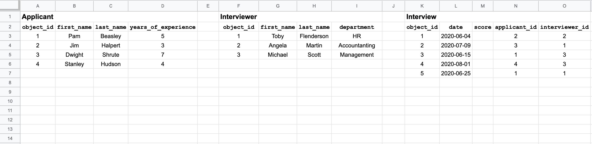

# Many to Many Relationships

<!--  -->

#### SWBATs:
1. Implement both sides of a many to many relationship
2. Practice keeping groups of data related to classes on the class as a class variable
3. Demonstrate **Single Source of Truth** by not storing collections of objects on other objects
4. Demonstrate **Single Source of Truth** by not storing one object in multiple collections

______

When we think about what entities we want to model in our programs, it's important to think about their relationships to each other. Yesterday, we talked about one to many relationships. 

- One to Many

    User -< Tweet

    State -< City

    Government -< Citizen

    Company -< Employee

    Team -< Player

    League -< Team -< Player

& today, let's talk about many to many! If we think about the Uber or Lyft domain, they have Passengers and Drivers. A driver can have many passengers and a passenger can have many drivers. A driver might not know about their passenger directly. Likewise, a passenger may not directly know about their driver. The way that a driver will know about their passenger is through the ride. When a driver gets a new ride, they will recieve the information about their passenger. Likewise, whenever a passenger books a new ride, they will recieve some information about their driver.

    Driver -< Ride >- Passenger

    - Driver has many Rides
    - Driver has many Passengers through Rides
    - Passenger has many Rides
    - Passenger has many Drivers through Rides

Another example we can think of is the relationship between doctor and patient entities. A doctor can have many patients and a patient can see many doctors. A doctor may not know who their patients are directly, but through appointments, they'll know. Likewise, through an appointment, a patient knows information about their doctor.

The purpose of the class through which the two classes are joined is to store a record for each of the combinations of these other two classes. You can think of this class as a place to store information or attributes of the relationships between the two entities.

 What are some other examples of many to many relationships?

<pre>
<ul>
<li>SocialMediaSite -< Account >- User</li>
<li>Student -< Enrollment >- Course </li>
<li>Applicant -< Interview >- Interviewer </li>
</ul>
</pre>

___

<!--  -->

## Applicant -< Interview >- Interviewer

#### How can an interviewer learn about the applicants?
    1. For an interviewer, find all their interviews
    2. For those interviews, get the applicants' information

In the Applicant -< Interview >- Interviewer, we have three classes - `Applicant`, `Interview`, `Interviewer`. Take a look at the image below. It's a [google sheet](sheets.new) with information about our classes. This is another way to visualize our classes and their attributes. It's also going to help us prepare for learning about databases next week. We display each entity in our domain (applicant, interviewer, interview). We show how each  entity has certain attributes. For example, our *applicant* object has an *object_id*, *first_name*, *last_name*, and *years_of_experience*. Each row is an instance of a class. Each object's *object_id* is an attribute that will allow us to uniquely identify an instance. If we are a large corporation with 3,000 applicants and 4 of our applicants are named "Jane Doe", we would easily be able to tell them apart in our code using their unique identifier, *object_id*.

*Interviewer* has many *Applicants* through  *Interview* and *Applicant* has many *Interviewers* through *Interview*, too. By examining the attributes of the *Interviewer* and *Applicant*, we can see that both of them have no direct access to each other without *Interview*. *Interview* knows who the participants are by having a reference to an instance of an applicant and a reference to an instance of an interviewer.

<!--  -->

___

### What are the steps we took to create the many to many relationship above?

...

---- 
#### Extra Resources

* [Time Complexity for Ruby developers](https://www.rubyguides.com/2018/03/time-complexity-for-ruby-developers/)

* [Ruby Fun Facts](https://www.geeksforgeeks.org/interesting-facts-about-ruby-programming-language/)

