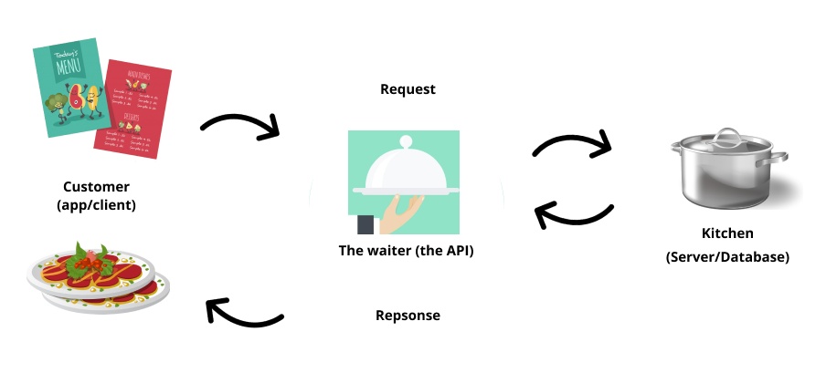

# Hashes & The Internet


### SWBATs:    
1. Recognize the parts of the request-response lifecycle
    - Define client and describe setting up the request
    - Define server and describe how the response is formatted
    - Identify HTML as a response type
    - Identify and define JSON
2. Define Application Programming Interface (API)
    - Describe the API of a Ruby Array
    - Explain the uses of an API on the internet
3. Practice making requests to an API and parsing and examining the result


#####  Outline
    5m   Intro
    5m   Overview of how the internet works
    5m   Ruby gems for working with APIs
    15m   Making requests to Google Books API
    30m   Work through deliverables
      


Currently, we don't have a way to dynamically get data. All the data we've been working with was either created by us manually or has been coming from the specs (like in Deli Counter interview) and is made-up. We know about methods, return values, and data structures in Ruby, but what's it worth if we're using fake data? Let's use what we know and learn how to use it with real data!

___

## What Happens When I Press Enter or Click a Link?

As we are browsing the internet and we click a link or type an address to our address bar, we say that a *request* is being made to a server. We're asking another computer somewhere else in the world to send us the webpage (a document) or some other information over the internet so that our browser can read it and present it to us. The _response_ is what our browser gets back from the server. This entire cycle is called the **request-response lifecycle**. When we make a request, we should get a response. We will learn a little more more about these requests and responses next lecture.

<p>
<details>
<summary>What do you see when you go to reddit.com/r/aww/? How about reddit.com/r/aww/.json?</summary>
<pre>
reddit.com/r/aww - a subreddit with posts about cute animals!

reddit.com/r/aww/.json - Woah! What is this? It looks like a hash, doesn't it? It's actually JSON though! Try to describe the structure based on your knowledge of Ruby hashes.
</pre>
</details>
</p>

___

## JavaScript Object Notation (JSON)

JSON is a language agnostic data format that we can get from websites. It's a type of string that a server sometimes sends. There are built-in Javascript functions that make it easy for us to play with JSON, but how do we use it with Ruby?


Well, we know about hashes in Ruby. Hashes look a lot like JSON and we can actually take that JSON and turn it into a Ruby Hash, so that we can use all the built-in Ruby methods that we've been using for hashes. But how the heck would we turn JSON into a Ruby hash, Michelle??? Well, we can use this module called `json` that comes from the Ruby standard library. The first thing we have to do is....you guessed it - `require 'json'`! Then from there, we will be using `JSON.parse(some_json_response_here)`, which we will see in action in a little.

___

## Gems for Working with APIs

As we've reviewed before, Gems are just code that other people have written that we can download and use in our own programs.

- [`rest-client`](https://github.com/rest-client/rest-client) is a gem that allows us to make HTTP requests.

- `json` is a module in the Ruby standard library that allows us to parse and create JSON.

Popular Gems have documentation that have instructions as well as examples. You can also always look at the source code of the Gem if you're up for it.

```
gem install rest-client
gem install pry
```
```
require 'pry'
require 'rest-client'
require 'json'
```

___

## What is an API?

In the context of web development, an API (Application Programming Interface) is a way for a web developer to interact with data on a server. We can think of it as a way of interacting programmatically with some sort of information from an application that we have or are building. An interface is usually something that is between you and something. It's something that allows you to interact with a potentially complex thing in a less complex manner.

You can think of an API as a waiter in a restaurant. Let's imagine a restaurant where you're the client and the kitchen is the system that prepares your order. The waiter is the critical link that communicates your order to the kitchen. You tell the waiter what you want to eat and the waiter takes your request to the kitchen. Once the meal is all done being prepared, the waiter takes it (the response) back to you! Yout don't really need to know anything about the kitchen or how they're preparing the meal. All you need to know is what sort of meals can requested and how to interact with the waiter in order to make those requests. 



Let's check out an API that serves us up some JSON!

___

## Using Google's Book API

https://www.googleapis.com/books/v1/volumes?q=ruby+programming

- Compare the above with https://www.reddit.com/r/aww/.json

- Discuss some of their differences and similarities.

- What do they look like? How are things nested or organized?

- What is the q= doing in the Google Books API?


___

### Deliverables
- Write an application that takes a search query from a user
- Make a Request to the GoogleBooks API using the user's search query input and get back some results
- Display all of the book titles that come back from this search query

    #### Steps
    1. Create a file for your project
    2. Add `rest-client`, `json`, and `pry` gems
    3. Make a search query using the Books API
        - Use `RestClient.get()` to GET a given url `https://www.googleapis.com/books/ v1/volumes?q=#{user_query}`
    4. Inspect the response object and see what we get. Use pry for this.
        - check out the value of `response["items"]` and `response.body`
    5. Use `JSON.parse()` and pass response object into this.
    6. Figure out how to get titles out of the Hash.
    7. Figure out how to list all of the titles

___

#### Extra Resources
- [List of Some Public APIs](https://github.com/public-apis/public-apis)
