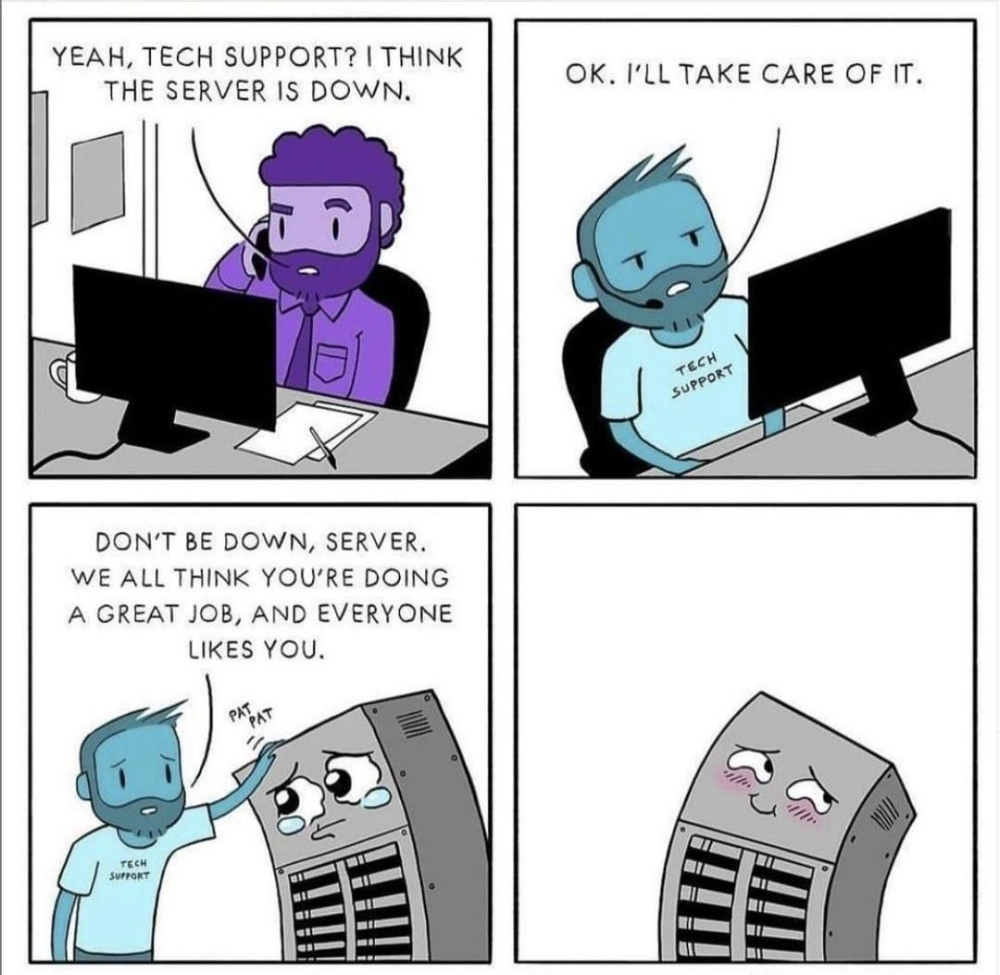

# Intro to Rails

## SWBATs

1. Create a new Rails application
2. Describe differences between Sinatra routing & Rails routing
3. Generate a model
4. Create routes
5. Generate a controller
6. Create actions/methods for a RESTful controller
7. Create views

___

### Outline

* [ ] Compare creating an app with Sinatra to creating an app with Rails
* [ ] Generate a model
* [ ] Create controller, routes, and views
  * [ ] Make route and controller action for `index` and `show` with custom routes
  * [ ] Demonstrate implicit rendering
* [ ] Demonstrate `link_to` helper and path helpers
  * [ ] `rails routes` and `/rails/info/routes`

___

____

### Rails Commands
* `rails new <app-name>` - create a new Rails app
* `rails c` - open a console
* `rails s` / `rails server` - start server
* `rails routes` - display all the routes in your app, also can viewed at http://localhost:3000/rails/info/routes
* `rails g migration <migration-name> <attribute:data-type> <attribute:data-type>` - generate a migration
* `rails g model <model-name> <attribute:data-type> <attribute:data-type>` - generate a model and a migration to create the table with specified columns
* `rails db:migrate` - run all pending migrations (same as `rake db:migrate` in Mod 1/Sinatra)

___

#### Helpful Bookmarks / Extra Resources

* [Rails Routing From The Outside In](https://guides.rubyonrails.org/routing.html)
* [link_to](https://apidock.com/rails/ActionView/Helpers/UrlHelper/link_to)
* [`byebug`](https://edgeguides.rubyonrails.org/debugging_rails_applications.html#debugging-with-the-byebug-gem)
* [List of some companies using Ruby on Rails](https://skillcrush.com/blog/37-rails-sites/)
